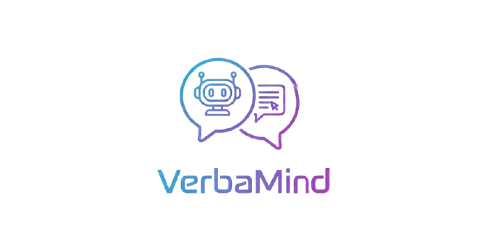
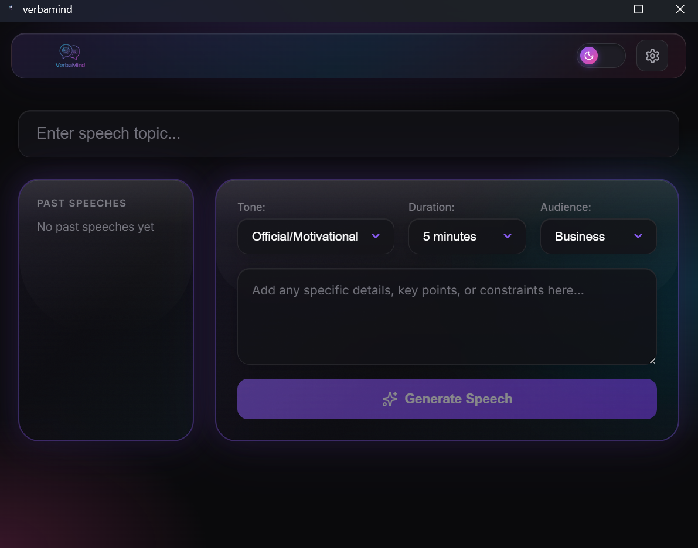
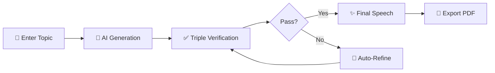

<p align="center">
  
</p>

<h1 align="center">VerbaMind</h1>

<p align="center">
  <strong>🎤 AI-Powered Speech Generation with Multi-Model Verification</strong>
</p>

<p align="center">
  <a href="#features">Features</a> •
  <a href="#screenshots">Screenshots</a> •
  <a href="#installation">Installation</a> •
  <a href="#usage">Usage</a> •
  <a href="#tech-stack">Tech Stack</a> •
  <a href="#license">License</a>
</p>

<p align="center">
  
  
  
  
</p>

<p align="center">
  
  
  
</p>

---

## ✨ Overview

**VerbaMind** is an intelligent desktop application that generates professional, natural-sounding speeches using the power of AI. What makes it unique is the **multi-model verification system** — three AI models work together to ensure your speech sounds human, matches the desired tone, and maintains logical coherence.

> 💡 Whether you need to prepare a business presentation, academic lecture, or a motivational talk, VerbaMind helps you create compelling speeches in minutes.

---

## 🚀 Features

<table>
<tr>
<td width="50%">

### 🤖 Multi-Model AI Generation
Leverage the power of **Claude**, **GPT-4**, or **Gemini** to generate your speeches. Use any one or combine all three for optimal results.

### ✅ Triple Verification System
Each speech passes through three AI verification checks:
- **Naturalness** — Does it sound human-written?
- **Style** — Does it match the chosen tone?
- **Logic** — Is the argumentation coherent?

### 📄 PDF Export
Export your speeches to PDF with 4 beautiful templates:
- Official
- Modern
- Minimal
- Academic

</td>
<td width="50%">

### 🎨 Modern UI/UX
- Sleek dark mode with glassmorphism effects
- Smooth animations powered by Framer Motion
- Responsive design that adapts to your workflow

### 💾 Speech History
Automatically save all generated speeches for easy access and reuse.

### 🔐 Privacy First
All API keys are stored **locally on your device**. Your data never touches our servers.

</td>
</tr>
</table>

---

## 📸 Screenshots

<p align="center">
  
</p>
---

## 🛠️ Installation

### Prerequisites

- **Node.js** 18 or higher
- **npm** or **yarn**
- **Rust** (for building Tauri desktop app)
- At least one API key:
  - [Claude API (Anthropic)](https://console.anthropic.com/)
  - [OpenAI API](https://platform.openai.com/api-keys)
  - [Gemini API (Google)](https://aistudio.google.com/app/apikey)

---

## 💻 Usage

### 1. Add API Keys
Click the ⚙️ **Settings** icon in the top-right corner and enter your API keys.

> 💡 **Tip:** For full multi-model verification, add all three API keys (Claude, OpenAI, Gemini).

### 2. Create a Speech
1. Enter your **speech topic**
2. Select the **tone** (Official, Motivational, Casual, Academic, Emotional, or Humorous)
3. Choose the **duration** (2–20+ minutes)
4. Specify your **audience** (Business, Students, General, Experts, or Mixed)
5. Optionally add **specific details** or constraints
6. Click **Generate Speech** ✨

### 3. Export & Use
- Review your generated speech with verification scores
- Regenerate if needed
- Export to PDF with your preferred template

---

## 🔧 How It Works



The verification system uses three specialized prompts:
1. **Naturalness Check** — Ensures the text sounds authentic and human-written
2. **Style Analysis** — Validates tone consistency and grammar
3. **Logic Review** — Checks structure and argument coherence

If any check fails, the speech is automatically refined until it passes all criteria.

---

## 🎯 Use Cases

| 🎓 Academic | 💼 Business | 🎤 Personal |
|------------|-------------|-------------|
| Lectures & seminars | Presentations & pitches | Wedding toasts |
| Thesis defenses | Team meetings | Award speeches |
| Conference talks | Client proposals | Motivational talks |

---

## 🏗️ Tech Stack

| Technology | Purpose |
|-----------|---------|
| **[Tauri 2.0](https://tauri.app/)** | Lightweight desktop framework (Rust core) |
| **[React 19](https://react.dev/)** | Modern UI framework |
| **[TypeScript](https://www.typescriptlang.org/)** | Type-safe development |
| **[Zustand](https://zustand-demo.pmnd.rs/)** | Minimal state management |
| **[Framer Motion](https://www.framer.com/motion/)** | Smooth animations |
| **[Lucide React](https://lucide.dev/)** | Beautiful icons |

---

## 📁 Project Structure

```
verbamind/
├── src/
│   ├── components/          # React components
│   │   ├── SpeechForm.tsx       # Main input form
│   │   ├── SpeechResult.tsx     # Display generated speech
│   │   ├── Settings.tsx         # API key configuration
│   │   └── History.tsx          # Past speeches list
│   ├── services/            # Core services
│   │   ├── llmService.ts        # AI API integrations
│   │   └── pdfService.ts        # PDF export logic
│   ├── stores/              # Zustand state stores
│   ├── types/               # TypeScript definitions
│   ├── App.tsx              # Main app component
│   └── index.css            # Global styles
├── src-tauri/               # Tauri/Rust backend
│   ├── src/
│   ├── icons/               # App icons
│   └── tauri.conf.json      # Tauri configuration
└── package.json
```

---

## 📄 License

This project is licensed under the **Rust License** — see the [LICENSE](LICENSE) file for details.

---

<p align="center">
  <strong>VerbaMind</strong> — Create speeches that move. ✨
</p>

<p align="center">
  Made with ❤️ by SpartaKoli!
</p>
